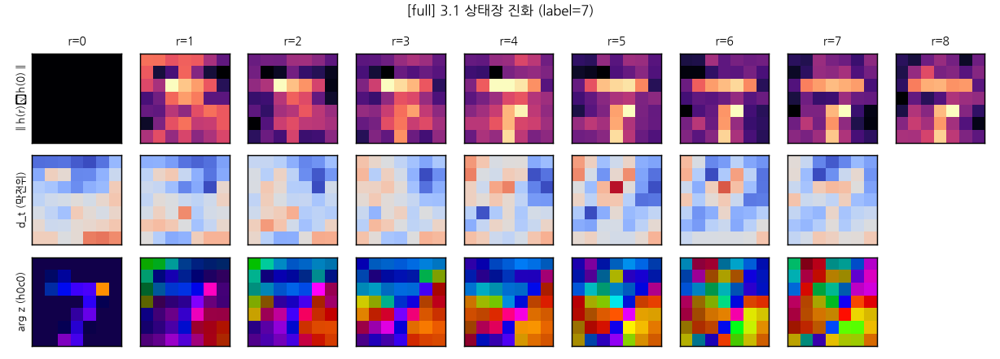
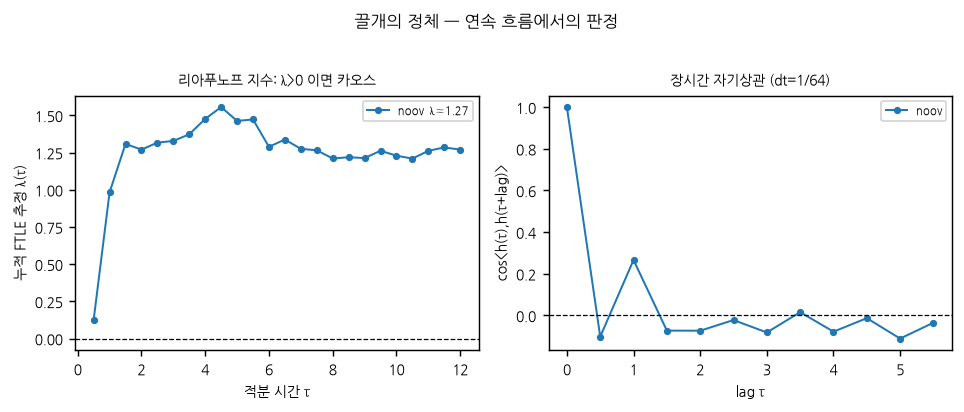
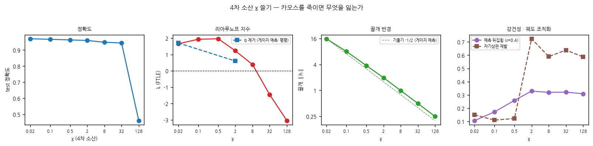
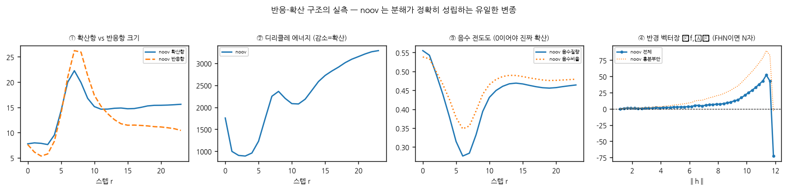
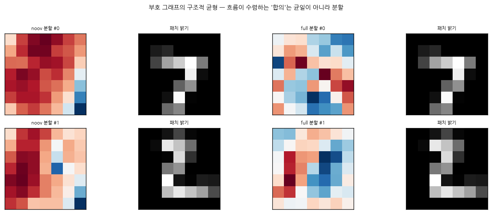
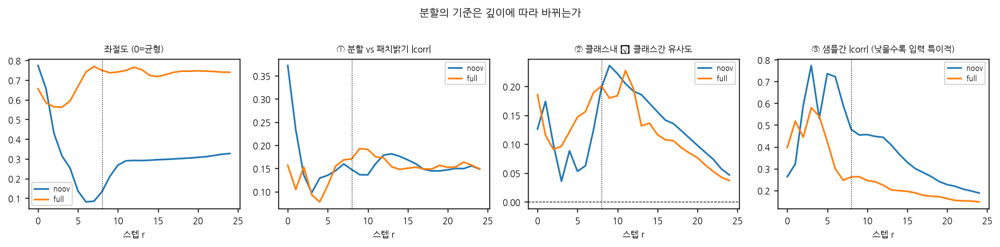

# Model 1 — 활성화함수 없는 3차 어텐션 동역학

「클로드 대화내용.txt」의 Model 1 사양을 구현하고, MNIST 학습과 사양 §3의 해석가능성 실험을
수행한 뒤, 사양의 이론적 주장들을 하나씩 검증한 기록.

> **진입점은 `INDEX.md`** — 결론·채택 원장·자기정정 기록이 거기 정리돼 있다.
> 이 문서는 실험 서사의 전체 기록이다. §8은 시간순 누적이라 정정이 겹겹이며,
> 최종 판정만 보려면 §8.7(상전이 표)·§8.8(경계 사영)과 INDEX 를 보라.

---

## 0. 한 줄 요약

**사양의 이론적 주장들은 "어텐션 행렬 `A`가 주어진 고정 그래프"라는 가정 위에서 참인데,
실제 모델은 매 재귀 스텝마다 `A`를 자기 상태로부터 다시 그린다.** 그 한 항의 차이가
gradient flow를 깨고, 한계주기를 이상한 끌개로 바꾸고, 반응-확산을 "주어진 그래프 위 확산"에서
부호형·비국소·준선형 RD 로 바꾼다 (2일차 §11.1 에서 확정).

핵심 수치:

| 항목 | 값 |
|---|---|
| MNIST test 정확도 (최고) | **97.62%** (`kern`, 26.5K 파라미터, 활성화함수 0개) |
| 끌개의 리아푸노프 지수 | **λ = +1.74** (유계 카오스) |
| `A` 고정 시 λ | **−0.16** (카오스 소멸) |
| `A` 고정의 MNIST 비용 | **−0.16%p** |
| 야코비안 비대칭도 (gradient flow 판정) | 실제 **0.575** / `A` 고정 **0.0000** |
| γ 게이지 검증 | γ×1600 에 λ 변화 4%, ‖h‖ 비 40.19 vs √1600 |

---

## 1. 구현

`model1.py`. 사양 §1–§2를 축약 없이 옮겼다.

| 사양 | 내용 |
|---|---|
| §1.2 | `h_t^(0) = Embed(x_t)`, MNIST 4×4 패치 → `T=49` |
| §1.3 | 진폭 분리 `ẑ = z/(‖z‖₂+ε)` → `\|a_tn\| ≤ 1` 구조적 보장 (1/t 정규화 불필요) |
| §1.4 | `U = diag(e^{−α−iθ})`, `α = softplus(·) > 0` → `‖S_t‖_F` 가 위치 `t` 에 무관하게 유계 |
| §2.2 / §2.5 | 양방향 + 2D 파수 벡터. 명시적 `T×T` 행렬로 계산 (두 스캔과 대수적으로 동일, 자기항 1회) |
| §1.5 | `f = Λh + Σ_m W_OV^(m) Σ_n a_tn^(m) v_n^(m) + (Σ_m d_t^(m)) b` |
| §1.6 | Strang 분할 + 해석적 해 `Φ_τ(h) = h/√(1+2γ‖h‖²τ)` (분모가 `1+` 이라 전역 정의) |
| §1.1(d) | `[A;B]` 를 `exp(skew)` 상단 `d_h` 행으로 두어 행-직교 (추가 파라미터 0) |
| §2.7 | 토큰별 로짓 후 평균 |

기본 설정: `T=49 / d=64 / H=4 / d_h=16 / p=8 / R=8`, AdamW 2e-3 OneCycle, 8 epoch.

### 1.1 성능 최적화 (연구 중 발견)

`W_C` 의 `matrix_exp` 가 `h` 에 무관한데 재귀 스텝마다 재계산되고 있었다. 재귀 밖으로 빼면
**forward 242.6 ms → 42.4 ms (5.7배)**. `torch.compile` 을 더하면 11.4 ms (누적 21배).
수학적으로 동일한 변경이라 이전 결과와 비교 가능하다.

> 재귀를 행렬 거듭제곱으로 접는 것(피보나치식)은 `A` 고정 시에만 가능하다.
> 단일 헤드 + `W_OV=I` 면 닫힌 해까지 나온다: `H(τ) = exp(τA)·H(0)·exp(τΛᵀ)`.
> `A` 가 `h` 에 의존하는 실제 모델에서는 원리적으로 불가능하다.

---

## 2. 학습한 모델

| 태그 | 변경점 | test | \|Δψ\| | 1/α 표준편차 | κ | 끌개 ‖h‖ | R=96 정확도 | λ (FTLE) |
|---|---|---|---|---|---|---|---|---|
| `full` | 완전 Model 1 | .9742 | 0.114 | 1.48 | 129 | 12.6 | .286 | +0.52 |
| `noov` | W_OV 제거, Λ 대각 | .9583 | 0.212 | 5.08 | 44 | 15.5 | .561 | +1.27 |
| `noisy` | σ=0.6 잡음 MNIST | .9672 | 0.097 | — | 134 | 14.3 | .554 | — |
| `psi0` | ψ ≡ 0 고정 | .9725 | 0.000 | — | 126 | 12.5 | .142 | — |
| `kern` | ψ·θ·α 학습률 ×30 | **.9762** | 0.322 | **5.75** | 141 | 12.2 | .258 | — |
| `randR` | 매 배치 R ~ U(4,16) | .9713 | 0.100 | — | 126 | 13.3 | **.947** | +1.74 |
| `lamonly` | ψ=0, W_OV=I, b=0 | .9535 | 0.000 | — | 42 | 14.7 | .680 | +1.09 |
| `gradflow` | 위 + Λ=0 | .9463 | 0.000 | — | 43 | 17.7 | .649 | +0.99 |
| `frozenA` | A 를 h⁽⁰⁾ 에서 고정 | .9697 | — | — | — | 14.8 | .918 | **−0.16** |
| `frozenA8` | 위 + dt 고정 | .9684 | — | — | — | 14.4 | .337 | −0.02 |
| `g0.02`…`g128` | γ 고정 쓸기 | .9704 → .4610 | — | — | — | 15.8 → 0.25 | — | +1.66 → −3.05 |

**모든 모델이 λ > 0 이다** (γ≥32 의 둘 제외). 구조를 어디까지 덜어내도 소산계가 되지 않는다.

---

## 3. 사양이 맞은 것

### 3.1 §1.7 흡수구 — 성립

시간 외삽 64스텝, `dt` 를 1/8→1/128 로 16배 줄여도 `‖h‖` 가 유계. `dt→0` 에서 15.5 로 수렴하므로
연속 흐름이 잘 정의돼 있다. 4차 소산이 2차 증폭을 이긴다는 논증은 옳다.

다만 예측 반경 `√((λmax+2κ)/γ) = 78.4` 는 실측 15.5 의 5배로 헐겁고,
이산화 조건 `R > κ` 가 `κ=129 ≫ R=8` 로 16배 위반돼도 안정하다. κ 가 최악 상한이고
실제 `a_tn` 은 부호가 섞여 상쇄되기 때문이다. **안전하지만 tight 하지 않다.**

### 3.2 §2 순수 좌곱셈 — 성립

`W_OV` 를 없애 채널 믹싱을 완전히 제거해도 **95.83%**. 사양의 첫 판정 기준은 통과.
그리고 구조를 덜어낸 쪽이 사양이 예측한 동역학에 더 가깝다 —
자기상관 재발 0.39(full 0.09), 정밀화 저항 .561(full .286), α 가 유일하게 실제로 움직였다.



*§3.1 상태장. 위: `‖h_t^(r) − h_t^(0)‖` — 숫자 획이 재귀가 진행되며 떠오른다.
가운데: `d_t = Σ_n a_tn`(막전위 유사물). 아래: `arg z` 를 색상으로 — 위상이 배경 전체로 퍼진다.*

---

## 4. 사양이 틀린 것

### 4.1 §2.4 "ψ 는 진동/소산을 가르는 유일한 파라미터" — 반증

ψ 를 0 에 못 박아 학습시켰다. `A` 는 정확히 대칭이 됐다(비대칭도 5.96e−08).
그런데 **진동이 사라지지 않고 오히려 강해졌다**:

| dt | 1/8 | 1/16 | 1/32 | 1/64 | 1/128 |
|---|---|---|---|---|---|
| `full` τ∈[6,8] 상대속도 | 2.97 | 2.53 | 2.68 | 2.93 | 3.07 |
| `psi0` 같은 지표 | 2.93 | 3.34 | 3.57 | 3.78 | **3.85** |

정확도도 97.25% 로 자유 ψ(97.42%)와 0.17%p 차이다. ψ 는 이 과제에서 성능에 거의 기여하지 않는다.

**ψ 를 막자 학습이 Λ 로 우회했다** — 비정규도 0.272 → 0.331, 선형 흥분의 최대 실수부 1.174 → 2.391.

### 4.2 논증이 끊어지는 지점 — 야코비안으로 특정

벡터장이 gradient field 인지는 야코비안 `Df` 의 대칭성으로 판정된다.
무작위 탐침 `u,v` 에 대해 `uᵀ(Df)v` 와 `vᵀ(Df)u` 를 JVP 로 24쌍 비교했다.
같은 점에서 `A` 를 얼린 대조군 `f̃(h) = A(h₀)h` 도 함께 쟀다 — 사양의 논증이 암묵적으로 가정한 대상이다.

| 모델 | f̃ (A 고정: 논증의 가정) | f (A 가 h 에 의존: 실제) |
|---|---|---|
| `gradflow` | **0.0000 ± 0.0000** | 0.575 ± 0.337 |
| `lamonly` | 0.529 ± 0.397 | 0.674 ± 0.373 |
| `full` | 0.654 ± 0.377 | 0.787 ± 0.306 |

**`gradflow` 에서 A 를 얼리면 비대칭도가 정확히 0** 이다. 사양의 논증은 그 가정 아래 완벽히 옳다.
차이는 오직 `A` 가 `h` 의 함수라는 것 하나다:

```
Df = A + (∂A/∂h)·h
     ↑        ↑
   지도    "내가 움직이면 지도도 바뀐다"
```

`A` 가 대칭이어도 둘째 항은 대칭일 이유가 없다. 원인이 세 겹인데 —
Λ 의 비정규성(사양 §1.7 이 이미 언급), `W_OV` 의 공간 불일치(사양 "미해결 지점" 2번),
그리고 **사양에 없던 세 번째: `A` 의 상태 의존성.** 앞의 둘을 제거해도(`gradflow`) λ=+0.99 로 카오스가 남는다.

### 4.3 §3.4 "고정점 / 닫힌 궤도 / 발산" — 네 번째 답

증분 `‖h(r+1)−h(r)‖` 이 64스텝까지 감쇠하지 않고, 자기상관 포락선이 한 주기 만에 0.1 아래로 붕괴하며,
PCA 궤도가 닫히지 않는다. Benettin 방식으로 유한시간 리아푸노프 지수를 재면:

| 모델 | λ | 판정 |
|---|---|---|
| `randR` (연속 흐름) | **+1.72** | 카오스 |
| `noov` | +1.27 | 카오스 |
| `full` | +0.52 | 카오스 + 준주기 성분 |
| `frozenA` | −0.16 | 준주기 회전 |

**유계 카오스 = 이상한 끌개.** 이것이 지금까지의 모든 이상 징후를 한 번에 설명한다.
그리고 이건 §1.7 의 실패가 아니라 **§1.7 이 있어서 가능한 결과**다 — 흡수구가 없었다면
λ>0 은 곧 발산이었다.



### 4.4 §3 "가중치 공유 재귀 = 동일 벡터장의 시간 전개" — 절반만 성립

τ=1 을 고정한 채 `dt` 만 줄이면(같은 ODE 를 더 정확히 적분) 성능이 무너진다:

| R (τ=1 고정) | 2 | 4 | **8 (학습)** | 16 | 32 | 96 |
|---|---|---|---|---|---|---|
| `full` | .149 | .516 | **.972** | .664 | .377 | .286 |
| `randR` | .277 | **.961** | .961 | .965 | .965 | **.947** |

**정성적 동역학**(유계성·지속 운동·끌개 반경)은 `dt` 에 무관하지만
**학습된 입출력 함수**는 `dt=1/8` 에 종속된다. 그런데 이것은 구조가 아니라 **학습의 문제**였다 —
매 배치 `dt` 를 무작위화하면(`randR`) R=96 정확도가 .286 → **.947** 이 되고 정확도 비용은 0.3%p 다.
**이 구조는 진짜 뉴럴 ODE 가 될 수 있다.**

### 4.5 §2.3 "양방향화가 학습된 Gabor 필터뱅크를 만든다" — 조건부

기본 설정에서 커널 파라미터가 초기값에 머문다(|Δψ|=0.114, α .099→.093).
잡음 MNIST 로 어렵게 해도 오히려 덜 움직였다(0.097). **원인은 과제 난이도가 아니라 그래디언트 스케일** —
ψ·θ·α 에만 30배 학습률을 주면 수용장 폭 표준편차가 1.48 → **5.75** 로 네 배가 되고
다중 스케일이 처음 생기며 정확도도 **97.62%** 로 전 모델 최고가 된다.

### 4.6 §3.5 Hopf 분기 — 없음

입력 대비 `c` 를 0.1→6.0 으로 쓸어도 끌개의 진동 진폭이 40개 지점 전부에서 0보다 크다.
고정점→한계주기 분기점이 없고 전 영역이 이미 진동 상태다.

---

## 5. γ 는 손잡이가 아니라 게이지

위상 정규화가 `a_tn` 을 `h` 에 대해 **0차 동차**로 만들었으므로, `h = u/√γ` 를 넣으면

```
u̇ = Λu + A(u)W_OV u − ‖u‖²u + √γ (Σ_m d_t) b
```

**`b` 와 `ε` 을 빼면 γ 가 방정식에서 완전히 사라진다.**

재학습 없이 학습된 가중치 그대로 검증:

| 변환 | λ (FTLE) | 끌개 ‖h‖ | ‖h‖ 비 | √s (예측) |
|---|---|---|---|---|
| 기준 | +1.727 | 13.22 | — | — |
| γ×16, h₀/4 | +1.665 | 3.339 | 3.96 | 4.0 |
| γ×100, h₀/10 | +1.682 | 1.315 | 10.05 | 10.0 |
| **γ×1600, h₀/40** | **+1.661** | 0.329 | **40.19** | **40.0** |

궤적 자체도 γ×100 에서 상대오차 **0.004** 로 일치한다 — λ≈1.7 인 계에서 τ=6 이면 실제 차이는
2.7만 배로 증폭됐어야 하므로 이 일치는 "같다"는 뜻이다.
독립 학습된 7개 모델에서도 `‖h‖ ∝ γ^(−1/2)` 가 5% 이내로 성립(15.8 → 8.0 → 3.8 → 2.0 → 0.99 → 0.50 → 0.25).

**따라서 §1.7 의 흡수구 반경은 조절 가능한 안정성 여유가 아니라 `h` 의 단위다.**
그리고 §3 의 조언 "γ 를 키워 소산을 강하게 걸어라" 는 동역학적으로 공허할 뿐 아니라
실측상 해롭다 — 정확도 .9704 → .4610, 잡음 뒤집힘 0.106 → 0.33.

**단, 학습에는 게이지가 아니다.** `b` 를 제거해도 γ 만 바꿔 학습하면 λ 가 +1.71 vs +0.60 으로 갈린다.
AdamW·weight decay·고정 임베딩 초기화가 스케일 등변이 아니기 때문이다.
**γ 는 동역학을 그대로 두고 최적화 문제만 바꾸므로 카오스 인과성을 묻는 도구로 부적절하다.**



---

## 6. 반응-확산인가 — 부호형·비국소·준선형으로 재분류 (판정은 §11.1)

분해 `Σa_tn h_n = Σa_tn(h_n−h_t) + (Σa_tn)h_t` 는 **대수 항등식**이라 어떤 행렬에도 성립한다.
물리적 내용은 `a ≥ 0` 일 때만 붙는다. 이 모델의 계수는 절반이 음수다.

`noov` 는 `Σ_m W_OV^(m)P_m = I` 가 정확히 성립해 분해가 블록 단위로 되살아나는 유일한 변종이므로,
여기서 나온 결과에는 "변환된 공간 탓"이라는 변명이 통하지 않는다.

### 6.1 걷어낸 잘못된 기각

처음에 "디리클레 에너지가 1757 → 3288 로 늘고 계수의 47.8% 가 음수이니 확산이 아니다"라고 적었다.
**둘 다 근거가 되지 못한다.** 에너지 증가는 튜링 패턴 형성의 정의이고,
음수 계수는 신경장 모형(Wilson–Cowan, Amari)의 표준 중심-주변(Mexican hat) 커널이다.

정리 수준에서 확실한 건 하나뿐이다: **전도도가 음이 아닌 확산 연산자는 디리클레 에너지를 증가시킬 수 없다**
(`dE/dt = −Σa_tn‖h_t−h_n‖² ≤ 0`). 그러니 물어야 할 것은 **확산항 자신의 dE/dt 기여**다.

### 6.2 항별 에너지 수지

| 항 | `noov` dE/dt 기여 | 비중 | `full` | 역할 |
|---|---|---|---|---|
| **확산** | **+15,269** | 39.1% | +32,633 | **주입** |
| 반응 | +8,365 | 21.4% | +7,037 | 주입 |
| Λ | +967 | 2.5% | +1,207 | 주입 |
| 4차 소산 | −14,451 | 37.0% | −17,054 | 소산 |

간선 부호별로 쪼개면: 양성 간선만 **−25,214**(소산), 음성 간선만 **+40,731**(주입), 합 +15,517
(직접 측정 +16,215, 상대차 4.5%).

**왜 음성이 이기는가**: 음성 간선이 걸린 패치 쌍의 평균 거리² 가 **40.5**, 양성 쪽은 **26.6**.
학습이 척력을 **이미 가장 다른 패치들 사이에** 배치했다 — 측면 억제와 윤곽 강화다.

> **튜링 메커니즘에서는 확산이 언제나 소산항**이고, 패턴은 두 화학종의 확산 속도 차이가
> 균일 정상상태를 불안정하게 만들어 생긴다. 여기서는 확산 자리의 항이 스스로 최대 주입원이다.
> **부호가 아니라 역할이 뒤바뀐 구조.**

### 6.3 그런데 패턴은 진짜다

상태장의 2D 공간 스펙트럼이 **`k* = 1.12`** 에서 봉우리를 갖고 **`P(k=0)/P(k*) = 0.000`** 이다.

> **정정 (후속 실험):** 미학습 모델(시드 3개)이 동일한 `k* = 1.12` 를 내고 θ×2 에서 1.88 로
> 이동한다. 즉 이 파장은 **학습이 선택한 것이 아니라 θ 초기분포의 유산**이다.
> 패턴(비균일 구조)의 존재는 유효하나 "파장 선택" 주장은 하향한다.

### 6.4 부호 그래프와 구조적 균형

정규화 부호 라플라시안 `I − D̄^{−1/2}A_sym D̄^{−1/2}` 로:

| | 좌절도 λ_min | 부호 무작위 비교군 | 참여비 PR / T | 스펙트럼 간극 |
|---|---|---|---|---|
| `noov` | **0.132** | 0.636 | 34.8 / 49 | **11배** |
| `full` | 0.723 | 0.637 | 19.1 / 49 | 없음 |

`noov` 는 무작위 부호 대비 **4.8배 덜 좌절**돼 있고, 전역에 퍼진 분할이며, 지배적 이분 구조가 하나다.
분할의 최대 파수 1.00 이 상태장의 `k*=1.12` 와 같은 척도 —
**"튜링 특징 파장"과 "균형 이분"은 같은 것의 두 측면.**

> 첫 측정에서 비정규화 라플라시안을 써서 `λ_min` 이 차수 낮은 구석 패치 하나에 국소화되는 인공물을
> 균형으로 오독했다. 정규화와 참여비를 함께 보고 나서야 결론이 섰다.

### 6.5 분할의 기준은 깊이에 따라 바뀐다

| `noov` · r | 0 | 2 | 4 | 6 | **8 (학습깊이)** | 12 | 16 | 24 |
|---|---|---|---|---|---|---|---|---|
| 좌절도 | 0.774 | 0.429 | 0.253 | **0.081** | 0.133 | 0.292 | 0.297 | 0.327 |
| \|corr\| 패치 밝기 | **0.372** | 0.136 | 0.129 | 0.145 | 0.147 | 0.179 | 0.160 | 0.148 |
| 클래스내 − 클래스간 | 0.126 | 0.099 | 0.088 | 0.062 | **0.198** | 0.192 | 0.141 | 0.047 |
| 샘플간 \|corr\| | 0.263 | 0.590 | 0.530 | **0.722** | 0.479 | 0.444 | 0.300 | 0.188 |

**세 단계 궤적**:
1. **r=0** — 획/배경 기준 (밝기 상관 0.372). 그래프는 좌절 상태(0.774).
2. **r=0→6, 골격 단계** — 분할이 입력에 무관해지고(0.26→0.72) 좌절도가 최소(0.081)로 떨어지는데
   클래스 정보는 오히려 줄어든다(0.126→0.062). 공유 골격을 먼저 세운다.
3. **r=6→8, 분화 단계** — 골격이 입력별로 갈라지고(0.72→0.48) 클래스 정보가 **0.062→0.198 로 세 배**
   뛰어 정점. **정확히 읽기헤드가 붙는 깊이에서.** 너머로 외삽하면 0.047 까지 무너진다.

`full` 에는 골격 단계가 없다(좌절도가 내려가지 않고 r=6~8 에서 오히려 0.74 로 최악).
그런데도 클래스 정보는 똑같이 r=8 에서 0.200 으로 정점 — **같은 목표를 다른 방식으로 달성**하며
`noov` 쪽이 읽을 수 있는 경로를 쓴다.

**결론(2일차 정정): 부호형·비국소·준선형 반응-확산계 — 균일모드 안정 · 유한 파수 진동 띠가
실측된다(§11.1, 명제 23). "부호 그래프 균형 흐름 + 4차 포화"는 그 계의 유한격자 서술이다.**
대화의 맨 첫 문단에서 이미 "Ginzburg-Landau / 결합 비선형 진동자의 텐서 일반화로 보는 게 타당하다"고
결론이 났었고, 실측은 그 첫 결론이 옳았다고 말한다.





---

## 7. `A` 고정 — 인과 실험

`A` 를 `h⁽⁰⁾` 에서 한 번만 계산해 고정하면 벡터장이 `h` 에 대해 선형이 되어 **카오스가 원리적으로 불가능**해진다.
입력에 대한 비선형성(`A₀ = A(Embed(x))` 는 여전히 임베딩의 3차 함수)은 건드리지 않으므로,
**"입력에 대한 비선형성"과 "재귀의 비선형성"을 정확히 분리**한다.

| 모델 | A | test | λ | 자기상관 재발 | 뒤집힘 σ=0.4 | epoch 시간 |
|---|---|---|---|---|---|---|
| `randR` | h 에 의존 | .9713 | +1.74 | −0.01 | **.088** | 60 s |
| `frozenA` | h⁽⁰⁾ 고정 | .9697 | −0.16 | −0.06 | .178 | **15 s** |
| `frozenA8` | 고정, dt 고정 | .9684 | −0.02 | **+0.60** | .242 | 13 s |

**카오스를 완전히 제거해도 MNIST 정확도는 0.16%p 떨어질 뿐이고 학습은 4배 빠르다.**

### 7.1 사양의 예측이 한꺼번에 되살아난다

| 사양의 예측 | A 가 h 에 의존 (실제) | A 고정 |
|---|---|---|
| §2.4 ψ=0 ⟹ gradient flow | 야코비안 비대칭 0.575 | **0.0000** |
| §3.4 R 을 늘리면 닫힌 궤도 | 재발 −0.01 (배회) | **+0.60** |
| 카오스 언급 없음 | λ = +1.74 | **−0.16** |

셋이 독립적으로 같은 결론을 가리킨다. **사양이 다루던 계는 이 모델이 아니라 이 모델의 "A 고정판"이었다.**

### 7.2 예상 밖: 카오스 쪽이 더 강건하다

| 모델 | 깨끗 | σ=0.2 | σ=0.4 | σ=0.8 | 뒤집힘 σ=0.4 |
|---|---|---|---|---|---|
| `randR` (λ=+1.74) | .961 | **.955** | **.900** | **.508** | **.088** |
| `frozenA` (λ=−0.16) | .963 | .935 | .811 | .405 | .178 |
| `frozenA8` (λ=−0.02) | .964 | .934 | .747 | .319 | .242 |

λ>0 은 **상태 공간**의 궤적 분리이지 **입력 공간** 섭동의 영향과 다른 양이다.
상태 의존 `A` 가 잡음 픽셀에 대해 어텐션을 다시 조정할 수 있다는 점이 강건성으로 작동한 것으로 보인다.

---

## 8. 순차 라운드가 필요한 과제 — parity 와 셀룰러 오토마타

MNIST 는 anytime 곡선이 r=6 에서 포화하므로 재귀의 비선형성을 요구하지 않는다.
"몇 라운드의 순차 비선형 갱신이 필요한가"를 손잡이로 갖는 과제로 옮겼다.

### 8.1 parity — 판별 실패

| | A 자유 | A 고정 |
|---|---|---|
| T=16 | **100%** (235s) | **100%** (91s) |
| T=32 | 50.5% | 50.4% |

양쪽 다 천장이거나 양쪽 다 바닥이라 판별력이 없다.
학습 곡선은 **그록킹**(3500~4500 step 까지 우연에 붙어 있다 500 step 만에 100% 로 점프).

성공한 모델은 **감쇠를 0 으로 낮춘 전역 집계 채널**을 만든다(수용장 128~3698 ≫ T).
실패한 T=32 모델은 수용장이 3.7 이라 32비트를 못 모은다.
**parity 는 정적인 해가 존재해 A 고정본도 풀 수 있으므로 잘못된 탐침.**

> 이 과정에서 "R=8 이면 3⁸=6561차라 표현력은 충분하다"는 제 논증이 틀렸음이 드러났다.
> `3^R` 차수 성장은 Model 0 의 성질이고, Model 1 은 진폭 정규화 때문에 어텐션이 **0차 동차**라
> 차수가 곱해지지 않는다. 벡터장은 1차 동차의 방향 의존 게이팅이다.

### 8.2 셀룰러 오토마타 — 판별 성공

이웃 그래프는 고정, 갱신은 상태에 비선형. 필요한 순차 라운드가 정확히 `k`.
`T=32`, 무작위 초기 상태, 2000 step, 전체일치(32칸 전부 정답) 기준.

- **Rule 90**: `s_i' = s_{i−1} ⊕ s_{i+1}`. GF(2) 선형이라 닫힌 형태 존재 —
  `s_i(k)` 는 이항계수 mod 2 로 정해지는 고정 위치들의 XOR이고 항수는 `2^popcount(k)`.
  그래서 k=1,2,4,8 은 전부 2항으로 붕괴하므로 **k = 1, 3, 7, 15**(항수 2, 4, 8, 16)를 썼다.
- **Rule 110**: 튜링 완전, GF(2) 선형이 아니라 닫힌 축약 없음. **k = 1, 2, 4, 8**.

| Rule | k | A 자유 | A 고정 |
|---|---|---|---|
| 90 | 1 | 1.0000 | 1.0000 |
| **90** | **3** | **1.0000** | **0.1290** |
| 90 | 7 | 0.0000 | 0.0000 |
| 90 | 15 | 0.0000 | 0.0000 |
| 110 | 1 | 1.0000 | 1.0000 |
| 110 | 2 | 1.0000 | 1.0000 |
| **110** | **4** | **0.9990** | **0.0829** |
| 110 | 8 | *(진행 중)* | 0.0000 |

**1회 가중치 생성이 사주는 순차 비선형 라운드는 대략 2~3.**
Rule 110 에서 k=1, 2 는 A 고정도 완벽하고 k=4 에서 붕괴한다.

### 8.3 기준선 — 우리 모델이 크게 밀린다

| 과제 | biGRU 2층 (150K) | CNN k층 (148~345K) | CNN 2층 (99K) | 우리 A 자유 (25K) |
|---|---|---|---|---|
| Rule 90, k=3 | **1.0000** | **1.0000** | 0.0000 | **1.0000** |
| Rule 90, k=7 | **0.9563** | 0.7308 | 0.0000 | 0.0000 |
| Rule 110, k=4 | **1.0000** | **1.0000** | 0.0000 | **0.9990** |
| Rule 110, k=8 | **0.9998** | — | — | *(진행 중)* |

**CNN 2층이 모든 k 에서 0.0000, CNN k층이 1.0000** — 깊이 분리가 우리 모델과 독립적으로 확립된다.
과제 자체는 완전히 학습 가능하다.

### 8.4 용량 통제 (진행 중)

위 비교는 **파라미터 수가 교란**이다. 우리 모델은 d=64 에서 **25,027개**로,
실패한 CNN 2층(99K)보다도 작다. 그리고 이 연구에서 관측된 전이는 전부 날카로우므로
(CNN 2층 vs k층, parity 그록킹) **격차의 크기는 문턱과의 거리에 대해 아무것도 말해주지 않는다.**

| d | 파라미터 | 대응 |
|---|---|---|
| 64 (현재) | 25,027 | — |
| 128 | 99,203 | CNN 2층 |
| 192 | 222,531 | biGRU 초과 |
| 256 | 395,011 | CNN 7층 초과 |

`Rule 90 k=7` 을 d=128/192/256 으로, `Rule 110 k=8` 을 d=192 로 재실행 중.
**d 를 올려 풀리면 "활성화 없음의 대가" 서술은 철회하고 용량 문턱 문제로 바꿔야 한다.**

두 번째 교란도 남는다: CNN(커널 3)과 GRU(순차)는 CA 와 일치하는 귀납 편향을 갖고 있고
우리 모델은 전역 부호 어텐션이다. 폭을 맞춰도 "활성화 없음의 대가"와 "귀납 편향 불일치"는 분리되지 않는다.

**결과 — 용량 가설이 옳았다**:

| d | 파라미터 | Rule 90 k=7 전체일치 |
|---|---|---|
| 64 | 25K | 0.0000 |
| 128 | 99K | 0.0000 |
| 192 | 222K | 0.0000 |
| **256** | **395K** | **1.0000** |

222K 와 395K 사이에 **날카로운 폭 문턱**이 있다. d=128/192 의 0.0000 을 보고
"용량 가설이 기각되는 중" 이라 적었던 것은 성급했다 — 이 연구에서 반복 관측된
날카로운 전이의 특성상, 문턱 아래에서는 어떤 폭도 0.0000 으로 보인다.

### 8.5 재해석: Rule 90 k=7 실패는 parity 의 SQ-경도

Rule 90 k=7 의 셀별 타깃은 **8항 parity** 다. 당초 이를 "구조적으로 못 푼다"(SQ-경도)로
읽었으나 d=256 결과가 수정을 강제한다: **경도는 절대적 불능이 아니라 폭 요구량으로 나타난다.**
biGRU / CNN-k층이 150~345K 로 푸는 것은 구조가 8항 XOR 을 2항 합성으로 인수분해해 주기
때문이고, 인수분해가 없는 전역 어텐션은 같은 것을 **폭으로 산다**(395K 필요).

수정된 예측: **① 커리큘럼** 또는 **② 국소화**(α 고정)는 폭 문턱을 낮출 것이다 (미실행).

### 8.7 최종 상전이 표 — 상태 의존 게이팅은 어떤 자원으로도 대체되지 않는다

**Rule 110, k=8** (8라운드 비선형 갱신 필요, 전체일치):

| 자원 | A 자유 | A 고정 |
|---|---|---|
| d=64, τ=1 (기본) | 0.007 | 0.000 |
| d=64, τ=2 (깊이 ×2) | 0.028 | 0.000 |
| d=64, τ=4 (깊이 ×4) | 0.131 | 0.001 |
| d=192, τ=1 (폭 ×9) | **0.940** | — |
| d=256, τ=1 (폭 ×16) | **0.997** | **0.000** |

**Rule 90, k=7** (8항 parity, 전체일치):

| d | A 자유 | A 고정 |
|---|---|---|
| 64–192 | 0.000 | 0.000 |
| 256 | **1.000** | **0.000** |

세 결론이 확정된다.

1. **A 고정은 폭(×16)에도 깊이(×4)에도 완전히 무반응이다.** 두 과제 모두에서.
   "폭 부족" / "깊이 부족" 대안 설명이 모두 명시적으로 기각된다.
   토큰별 반경 포화(정규화 비선형성)는 τ 를 늘려도 라운드를 사지 못한다.
2. **A 자유에게는 폭이 라운드를 산다** — 그리고 환율은 폭 ≫ 깊이다
   (깊이 ×4: 0.007→0.131 vs 폭 ×9: 0.007→0.940).
3. 따라서 이 아키텍처에서 순차 비선형 계산의 **유일한 원천은 상태 의존 게이팅** `A(h)` 이고,
   폭은 그것의 증폭기다. frozenA_g0(97.06%)와 합치면: MNIST 는 게이팅 1회로 충분했고,
   CA 는 게이팅 반복이 필수이며, 그 반복의 용량은 폭이 정한다.

### 8.8 경계 사영 — 첫 번째 검증된 구조 개선

제안(사용자): τ 블록 경계(R 스텝마다)에서만 채널 사영 `W_O` 를 적용한다.
블록 내부는 순수 흐름이라 해석(확산 분해·에너지 수지)이 블록 단위로 보존되고,
혼합은 셀 수 있는 이산 경계로 격리된다. `h ← W_O h`, 항등 초기화, 파라미터 `d²` 1개.

**2×2 요인 설계** (Rule 110 k=8, τ=4, d=64, 전체일치):

| | 경계 없음 | 경계 W_O | 경계 효과 |
|---|---|---|---|
| noov (스텝 혼합 없음) | 0.0002 | 0.0140 | +0.014 |
| full (스텝 혼합 있음) | 0.1306 | **0.4143** | **+0.284** |

- **가산 가설 기각**: 혼합 이벤트당 기여가 일정하다는 사전 등록 예측(fullWO≈0.14–0.15)을
  3배 초과. 경계 재부호화는 독립 메커니즘이며 매 스텝 혼합과 **강한 양의 시너지**.
- 상호작용의 해석: 경계 단독은 약하다 — 재부호화가 만든 좌표계의 정보를
  흐름 안으로 전파할 스텝 혼합이 있어야 가치가 실현된다.
- 학습 속도 정확히 2배 (fullWO 의 step 1000 = full 의 step 2000), 2000 step 에서 미포화.
- **d=64 기록 0.131 → 0.414 (2000 step) → 0.879 (4000 step, 여전히 미포화).**
  d=192(222K)의 0.940 에 파라미터 1/7.6 로 근접 — **경계 사영 + 학습 2배 ≈ 폭 9배.**
- 구조적 차이 주의: full 대비 "빈도만 줄인 것"이 아니다 — 경계 사영은 (i) 증분이 아니라
  **상태 전체**를 (ii) 잔차 없이 (iii) 전역 단일 사상으로 재부호화한다.
  순수 빈도/잔차형/전역성 격리는 후속 과제.

---

## 9. 문헌 지형

우리 구조의 조건: (a) 활성화 없음 (b) 가중치 공유 깊이 재귀 (c) 어텐션을 매 스텝 은닉상태에서 재계산
(d) softmax 없는 선형 어텐션.

| 조합 | 선례 | 차이 |
|---|---|---|
| (b)+(c) | Universal / Looped Transformer, Huginn·Ouro | MLP·softmax·활성화 있음 |
| (b)+(c) 이론 | 상호작용 입자계, 클러스터링 정리 (Geshkovski 등) | **음이 아닌 가중치 가정** |
| (a) | Π-Nets, ISAN | 재귀가 상태에 아핀 |
| (a)+(d) | DeltaNet, TTT-Linear, GLA, Mamba | **상태에 아핀** (병렬 스캔 유지) |
| (d)+신경과학 | Spikformer, Spike-driven Transformer | 스파이크 문턱이 활성화 |
| 진동자 | CoRNN(tanh), LinOSS(선형), Stuart–Landau GNN | 상태 의존 비선형 전이 없음 |
| **(a)+(b)+(c)+(d)** | **못 찾음** | — |

**핵심 관찰**: 어텐션 동역학의 클러스터링 정리들은 전부 **softmax = 음이 아닌 가중치**를 전제한다.
음이 아니면 진짜 확산이고, 최대원리와 에너지 소산이 따라오고, 클러스터링이 정리로 나온다.
우리 모델은 위상 정규화 때문에 `a_tn ∈ [−1,1]` 로 부호가 섞여 **그 가정 밖**에 있다.
그래서 에너지가 늘고, 이분 분할이 생기고, 카오스가 나온다.
**"왜 아무도 어텐션 동역학에서 카오스를 보고하지 않았나"에 대한 답: 연구된 영역에서는 원리적으로 안 나온다.**

인과 마스킹 하의 클러스터링도 이미 연구돼 있으므로(Karagodin & Polyanskiy),
캐주얼 설정으로 옮길 때의 비교 기준선은 그쪽이다.

**추가 앵커 (모델 재분류 후):**
- **A 고정 = 부호 결합 Stuart–Landau 네트워크, A 자유 = 상태 의존(co-evolving) 결합** —
  적응 결합 진동자 네트워크 문헌(카오스·키메라)이 A 자유 쪽의 이론적 이웃.
- **부호 Kuramoto / Lohe 모형**: 반발 결합이 양극(antipodal) 클러스터를 만든다 —
  §6.4 의 "합의 = 이분 분할" 유비의 문헌 대응.
- **토큰별 방향 정규화 어텐션 = cosine attention** (Swin V2 가 안정성 목적으로 사용).
- **Gated Linear Networks**: 게이팅만으로 비선형성을 얻는 망의 보편성 결과 —
  THEORY §6.2 (A 고정 클래스의 표현력) 에 가장 가까운 기존 이론.
- **정규화 비선형성**: LayerNorm 의 비선형성만으로 표현력이 확보된다는 계열 —
  frozenA 의 MNIST 96.97% 와 정합.

### 참고문헌

- [The emergence of clusters in self-attention dynamics](https://arxiv.org/pdf/2305.05465)
- [A mathematical perspective on Transformers](https://people.lids.mit.edu/yp/homepage/data/2023_transformers2.pdf)
- [Clustering in Causal Attention Masking](https://arxiv.org/pdf/2411.04990)
- [Input Switched Affine Networks (ISAN)](https://arxiv.org/abs/1611.09434)
- [Π-nets: Deep Polynomial Neural Networks](https://arxiv.org/abs/2003.03828)
- [Learning to (Learn at Test Time)](https://arxiv.org/abs/2407.04620)
- [Oscillatory State-Space Models (LinOSS)](https://arxiv.org/abs/2410.03943)
- [Spikformer](https://arxiv.org/abs/2209.15425)
- [Attention-Only Transformers and Implementing MLPs with Attention Heads](https://arxiv.org/abs/2309.08593)

---

## 10. 이 모델의 동역학은 어떻게 학습되는가

**학습이 거의 안 건드리는 것**: 위치 커널(ψ, θ, α). 기본 설정에서 초기값에 방치되고,
커널 전용 학습률을 30배 줘야 움직인다.

**실제로 학습되는 것**: 임베딩·Λ·W_OV·W_cls, 그리고 이들이 만드는 **부호 있는 혼합 그래프**.
학습은 척력 간선을 이미 가장 다른 패치 쌍 위에 배치한다(측면 억제).

**손잡이가 아니었던 것**: γ. 스케일 게이지이므로 학습이 γ 를 0.1→0.042 로 내리는 건
소산 약화가 아니라 진폭 단위 선택이다.

**R 스텝 동안**: 저수준 특징(r=0) → 공유 균형 골격(r=6) → 클래스 분화(r=8, 읽기헤드 위치) → 붕괴(r>8).

**그 동역학이 계산에 쓰이는가**: MNIST 에서는 아니오(A 고정 −0.16%p).
CA 에서는 예 — 다만 사거리가 1~2 라운드 남짓이고, 용량 통제 결과를 봐야 확정된다.

| 사양이 기대한 학습 | 실제로 일어나는 학습 |
|---|---|
| ψ 를 조율해 진동/소산 상을 고름 | ψ 는 초기값에 방치, 진동은 Λ 의 비정규성에서 옴 |
| γ 를 키워 소산을 강하게 검 | γ 는 스케일 게이지, 키우면 성능만 나빠짐 |
| 양방향 커널이 Gabor 필터뱅크로 학습됨 | 그래디언트가 안 흘러 학습 안 됨 (lr 30배면 됨) |
| R 스텝이 반복 정제 | 골격 6스텝 + 분화 2스텝, 그 뒤엔 붕괴 |
| 3차 동역학이 비선형성의 원천 | 비선형성은 `x → A` 사상에 있고 재귀의 h-비선형성은 0.16%p |

---

## 11. 2일차 (08-22) — 분산관계 · 장 추적 · sheaf

> 명제 번호는 THEORY.md §9. 실행: `dispersion.py` `fields.py` `spectral*.py` `hop_task.py`.

### 11.1 분산관계 — §6 판정 철회, RD 재분류

균일 상태에서 어텐션은 정확히 병진불변 합성곱 `a(Δ) = Σ_j w_j e^{−α_j‖Δ‖₁} cos(ψ_j+θ_j·Δ)`.
무한격자 심볼(명제 22): Re  는 cos ψ 가중, Im  는 sin ψ 가중 — **ψ=0 ⟺ Im≡0**
(psi0 실측 0.0e+0), 띠 위치 |k*| ≈ ⟨|θ|⟩ (실측 1.35 vs 예측 1.20 — 자기정정 6 의 이유가 유도로 닫힘).

유한격자 정확 대각화 (균일 고정점 기준):

| | 균일모드 | max Re λ @ \|k*\| | \|Im\| | 판정 |
|---|---|---|---|---|
| noov | −0.047 | +2.78 @ 0.91 | 7.53 | 튜링형·진동 |
| noov 미학습 | −0.000 | +1.44 @ 1.86 | 0.12 | 띠 존재·거의 정지 |
| full | −0.72 | +7.15 @ 1.82 | 7.35 | 튜링형·진동 |
| full 미학습 | +1.24 | +7.28 @ 1.55 | 2.84 | 균일도 불안정 |
| kern | −0.25 | +6.55 @ 1.45 | 3.32 | 불안정 모드 339→70 |

**학습의 역할은 띠의 창조가 아니라(미학습도 보유) 진동화(\|Im\| 63배)·협대역화·(full)균일 안정화.**
§6 의 "반응-확산이 아니다" 철회 → **부호형·비국소·준선형 RD (Swift–Hohenberg/신경장 지파)**.
측정(§6.2–6.5)은 전부 유효 — 죽은 것은 판정뿐. 균일 기저는 궤적이 그 근방을 지날 때만 유효
(CA 에선 무의미: 불안정 0/2048 — 자기정정 9 의 출처).

### 11.2 noov 의 정확한 구조 — 채널 비혼합 (명제 21)

검사 사실: noov 의 채널 간 상호작용은 공유 스칼라 장 `{a^(m), d_t, ‖h‖}` 경유가 전부다.
⟹ noov = **공유 부호 전도도의 d종 반응-확산계**. 장을 고정하면 채널별 선형·아핀.

### 11.3 장 추적 교리 (`fields.py`) — "무엇을 측정하는가"의 답

기록-재생 상대오차 **정확히 0** (3 모델) — 조건부 선형성은 근사가 아니라 항등.

정확한 분해 `logits = W·L_장[h₀] + c_장` 의 단독 분류 정확도:

| | 전체 | c(장 항)만 | L(수송)만 | ‖c‖/‖h‖ |
|---|---|---|---|---|
| noov | 1.000 | 0.375 | 0.833 | 0.53 |
| full | 1.000 | 0.208 | 0.990 | 0.18 |
| CA k4 | 1.000 | **0.766** | 1.000 | 0.09 |

장 이식 (샘플 i 의 장 × 샘플 j 의 초기상태) — **사전 등록 적중**:

| | 장 공여자 정답률 | 상태 공여자 정답률 |
|---|---|---|
| noov | **0.604** | 0.063 (우연 0.10 이하) |
| full | **0.594** | 0.073 |
| CA k4 | **0.851** | 0.520 (= 우연) |

**계산은 화물이 아니라 라우팅에 있다** — §10 의 상관 증거가 개입 인과로 승급 (명제 25).

실시간 구조화: CA 의 `d_t` 장이 입력 표현(corr −0.83)에서 정답 표현(+0.64)으로 r 을 따라
회전(교차 r≈5–6). MNIST noov 는 밝기 탈착(r2 ≈0)→재부착(r7 +0.22) — §6.5 3단계의 장 수준 재현.
`Δa/‖a‖` 는 끝까지 ≈0.4 — **장은 정착하지 않는다** (명제 24: 시간 경계값 문제).
commitment depth: MNIST 평균 5.7(퍼짐) / CA 6.97(r=7 에 52/64 집중) — "필요 라운드"의 직독.

폐기: 점별 고유모드 분석 — 기저(균일/끌개)에 결론이 뒤집힘. 정공법은 공변 리아푸노프 벡터(미결).

### 11.4 스펙트럼 반경 (`spectral*.py`) — DEQ 판정

블록 사상 ρ(G^R): full 7.08 / noov 1.46 / randR 3.31 / **frozenA8 0.75** (유일 수축 — 순차계산 불능 판).
λ(FTLE)와 순위 역전(full 이 λ 최저·ρ 최고) — **DEQ 판정은 ρ 로 해야 한다.**
학습 후 전 설정 ρ>1 → DEQ/IFT 불가(현 좌표). contract 는 학습 후에도 수축 유지(ρ(W_O) 0.18→0.60).
단 블록 ρ 는 성능 예측자로 **실패** (noovC 가 최저 ρ 2.06 인데 성능 0.073).

### 11.5 sheaf 값 경로 — 채택 (명제 26)

값 경로 족: noov=(P,Pᵀ) ⊂ **sheaf=(W,Wᵀ)** vs full=(P,W자유). 수송 `WᵀW` = 대칭 PSD =
**"학습된 종(species)"**: 헤드별 고유기저에서 종별 확산, 혼합 = 헤드 간 기저 불일치.
간선별 에너지 부호 = sign(a_tn) 이 혼합 하에도 보존 (full 의 부호 뒤집힘이 원리적으로 불가).

Rule 110 k=8, τ=4, 2000 step:

| | W_O 없음 | contract W_O | 배율 |
|---|---|---|---|
| noov (Λdiag) | 0.0002 | 0.0731 | — |
| sheaf + Λdiag | — | 0.3922 | — |
| sheaf + Λfull | **0.1656** | 0.5029 | 3.0× |
| full + Λfull | 0.1306 | 0.6655 | 5.1× |

사전 등록 3연속 적중: ①종 혼합이 noov 벽을 뚫음(5.4×) ②Λ 가 간극 절반(0.392→0.503)
③혼합·재부호화는 **보완재**. 관찰: W_O 없이는 sheaf ≥ full — 비대칭 수송의 우위는 경계
수축이 있을 때만 실현(과도성장 가설, 미검증).

**포화 비교 (4000 step, 동일 예산)**: sheaf **0.9498** vs full 0.9886 — 2000 step 의 1.32배
간극이 포화점에서 소멸. **잔여 간극의 정체는 포화 속도(최적화)이고, 조건부 회전은 이 과제의
필수 자원이 아니다.** 잔여: 오차율 5.0% vs 1.1%(4.4배), sheaf 는 4000 에서도 상승 중.
포화판의 장: 정답 표현 |corr| 0.25→0.58 (부호는 판독이 흡수하므로 크기만 유의).

### 11.6 ICL 축 (n-hop) — 부정적 결과 (NHOP.md)

과제: 인스턴스마다 새 순환 π 의 그래프를 제시, `π^n(q)` 검색. n=1 = 표준 induction head.
- **n=1**: d=256 에서 A자유·A고정 모두 1.000 (16k step 통일 예산). **동일 파라미터(425K)
  트랜스포머가 더 빠름** (0.95 도달 ~1.8k vs ~2.8k step)
- **n=2**: 전 설정이 **ln 7 벽** (τ1/τ4/±W_O + TF L2/L4 전부 loss≈1.95, 질의≈1/7) —
  순수 n=2 는 최적화 불능(저차 상관 부재). 문헌(Sanford–Hsu–Telgarsky 2024): 멀티태스크
  학습 필수, 깊이 ⌊log₂k⌋+2 상전이, 커널 어텐션엔 L≥k 하한 (단 T≫특징차원에서만 유효)
- **W_O·τ 는 hop 에 무효** → W_O 적용 범위 확정: 고정 그래프 순차 갱신 (CA·스도쿠 클래스)
- 커널 lr ×30 강등: hop 에서 ×1 과 동일 (0.998 vs 0.999); 과제가 요구하면 ×1 로도 α 40배 이동

결론: **ICL 은 이 구조의 비교우위 축이 아니다.** 스도쿠(고정 그래프 클래스)는 영향받지 않는다.

### 11.7 스도쿠 이식 실전 (당일 후반) — URM 하네스 위 첫 학습들

URM(refs/URM) 하네스에 우리 코어를 이식(`models/lt/lt.py`: 이중 루프·경계 주입·ACT 제거·
detach 세그먼트)하고 sudoku-extreme 1k+aug1000 에서 연속 실험. 런 원장:

| 런 | 구성 | 결과 | 사인/조치 |
|---|---|---|---|
| d768 v1 | 게이트 없음 | 전선 후퇴 (0.587→0.540) | **carry 익사** (노름비 0.47) + **wd=1.0 잠식** ((0.9999)^15k≈0.22 — ψθαγ 가 삭음) |
| d768 이중수선 | 주입 게이트 β + wd 그룹 분리 | 셀 0.638@23k, +0.01/eval 전진 | **조기 평형** 발견 (세그 ~3 고정점, 질만 상승 0.44→0.47) |
| d768 SwiGLU | 경계 = g·h+SwiGLU(h) (영 init) | **0.659@4.8k** — 수렴 가속 | 경계 = 격리된 비선형 구역 (내부 흐름 순수 유지) |
| d768 τ=2 | 스텝 8→16 (dt 유지) | **실패** 0.29@6k | e^{λτ} 그래디언트 잡음화 → DAMPING.md (μ 마찰 부재 진단) |
| d832 SwiGLU | URM 파라미터 정합 (14.1M vs 13.7M) | 주행 중 | 초반 폭 널 (0.660@4.5k ≈ d768) |
| URM 기준선 | 원본 스크립트 (flash+compile 1.74×) | 셀 ~0.87@5k, 완주 미완 | 총깊이 6배 (48 vs 8 적용/세그). 배치 exact 관찰은 표시 버그로 무효 — 재실행 필요 |

칸별 전파 깊이 분해(`cell_depth.py`): 주어짐 31.2% / 전파확정 16.4% (최대 깊이 19) /
**탐색 필요 52.4%** — 셀 ~48% = 완전 전파 천장, ~60% = +제약 찍기 천장 (60% 정체의 정량 해부).
설계 메모 파생: DAMPING.md (μ), KCYCLE.md (K-순환, 총깊이 회계), PLAN.md (다음 세션).

---

## 12. 미해결 / 다음 단계

1. **sheaf 잔여 1.3배** — 4000 step 포화 비교 + sheaf+plain 셀 (재부호화/수축 몫 분리)
2. **공변 리아푸노프 벡터** — 모드-읽기 정렬 귀속의 유일한 정공법
3. 시드 복제 · 캐주얼 전환 · 귀납 편향 분리 (1일차 이월)
4. **스도쿠 착수** (SUDOKU.md) — 레시피 확정됨

## 부록 A. 파일

| 파일 | 역할 |
|---|---|
| `INDEX.md` / `RESULTS.md` / `SUDOKU.md` | 색인·결론 원장 / 학습 101건 자동 표 / 다음 단계 설계 |
| `model1.py` | 사양 구현. `--freeze_A`, `--psi_zero`, `boundary_wo`/`wo_mode`, `positions`/`vocab`, `pool` |
| `train.py` | MNIST 학습. `--rand_R`, `--kernel_lr_mult`, `--fix_gamma`, `--compile` |
| `interp.py` | §3.1–3.7 해석가능성 실험 |
| `dt_sweep.py` | dt 와 τ 분리 (§4.4) |
| `attractor.py` | FTLE(Benettin) + 장시간 자기상관 (§4.3) |
| `rd_analysis.py` | 확산/반응 분해, 음수 전도도, 반경 벡터장 (§6) |
| `turing.py` | 항별 에너지 수지 + 공간 스펙트럼 (§6.2–6.3) |
| `balance.py` | 부호 그래프 구조적 균형 (§6.4) |
| `partition_depth.py` | 깊이별 분할 기준 추적 (§6.5) |
| `robustness.py` | 입력 섭동 강건성 (§7.2) |
| `seq_task.py` | parity (§8.1) |
| `ca_task.py` | 셀룰러 오토마타 (§8.2) |
| `ca_baseline.py` | biGRU / CNN 기준선 (§8.3) |
| `compare.py`, `gamma_report.py`, `ca_summary.py` | 종합 그림·표 |
| `dispersion.py` | 분산관계 — 닫힌 심볼 + 유한격자 대각화 (§11.1) |
| `spectral.py` / `spectral_wo.py` | 블록 사상 스펙트럼 반경, W_O 포함 (§11.4) |
| `fields.py` | 장 추적 교리 — 기록·재생·분해·이식 (§11.3) |
| `modes.py` / `modes2.py` | 점별 모드 분석 (폐기 — 자기정정 9 의 기록) |
| `hop_task.py` / `hop_baseline.py` | n-hop 과제 + 파라미터 정합 TF 기준선 (§11.6) |
| `NHOP.md` | n-hop 문제 분석 (아키텍처 무관) |
| `viz_fields.py` | §11 시각화 — 장 계산·균형 흐름·심볼 곡면 (figs/field_computation·balance_flow·dispersion_symbol) |

## 부록 B. 재현

```bash
python3 train.py --tag full  --epochs 8
python3 train.py --tag noov  --epochs 8 --no_ov --lam_mode diag
python3 train.py --tag kern  --epochs 8 --kernel_lr_mult 30
python3 train.py --tag randR --epochs 8 --rand_R 4,16
python3 train.py --tag frozenA --epochs 8 --freeze_A --rand_R 4,16

python3 interp.py --tag full --Rmax 64
python3 attractor.py full noov randR frozenA
python3 rd_analysis.py noov full && python3 turing.py noov full
python3 balance.py noov full && python3 partition_depth.py noov full

python3 ca_task.py --tag ca110_k4_full --rule 110 --k 4 --T 32 --steps 2000
python3 ca_task.py --tag ca110_k4_frozen --rule 110 --k 4 --T 32 --steps 2000 --freeze_A
python3 ca_baseline.py --arch gru --L 2 --rule 110 --k 4
```
